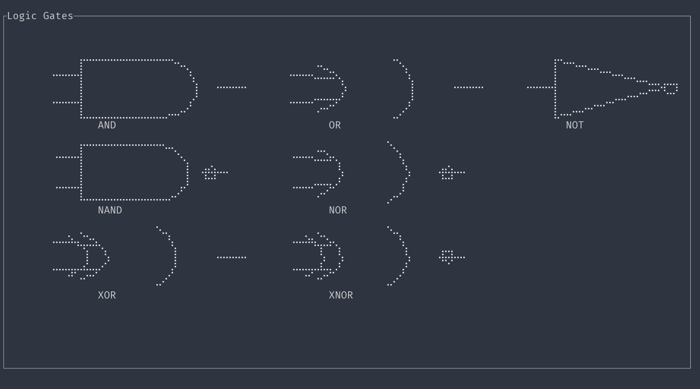

# Kiroku 

Kiroku is an application that takes a boolean expression like `A + B * C ^ D` and creates a circuit, truth table and Karnaugh Map. 


## Symbols 

`!` = NOT

`&` = AND

`|` = OR 

`^` = XOR 

`!&` = NAND 

`!|` = NOR 

`!^` = XNOR


Enter an expression like this 

```bash 
A ^ B !| C & (!D !^ E)
```

and press `Enter`


To switch between tabs, use the arrow keys. 

## Upcoming Logic Gates 



The above picture contains the symbols of the upcoming logic gates feature.

Currently the K-Map only supports from 2-6 variables.

## Installation 

### From crates.io

```bash
cargo install kiroku
```

### From source 

Clone this repo and `cd` into it and run 

```bash
cargo run --release
```

## Features 

- [x] Truth Table generator (From expression)
- [x] Beautify the Table
- [x] Add support for XOR, XNOR , NOR and NAND operations
- [x] User input for expression
- [x] K-Map generation
- [ ] Circuit Generation
- [ ] Equation Simplification
- [ ] Extend K-Map range

## Output


